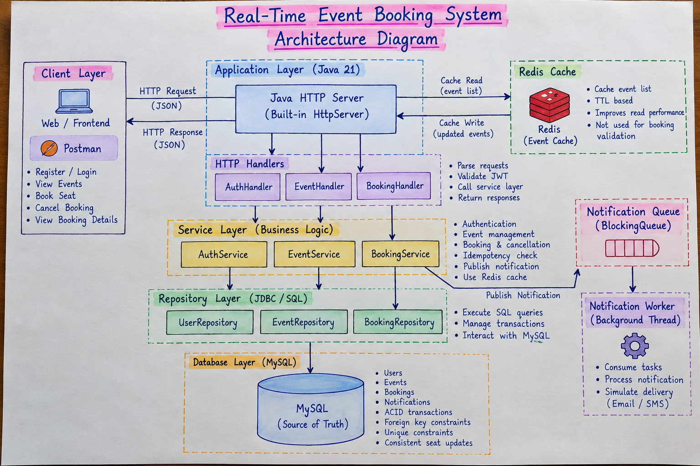
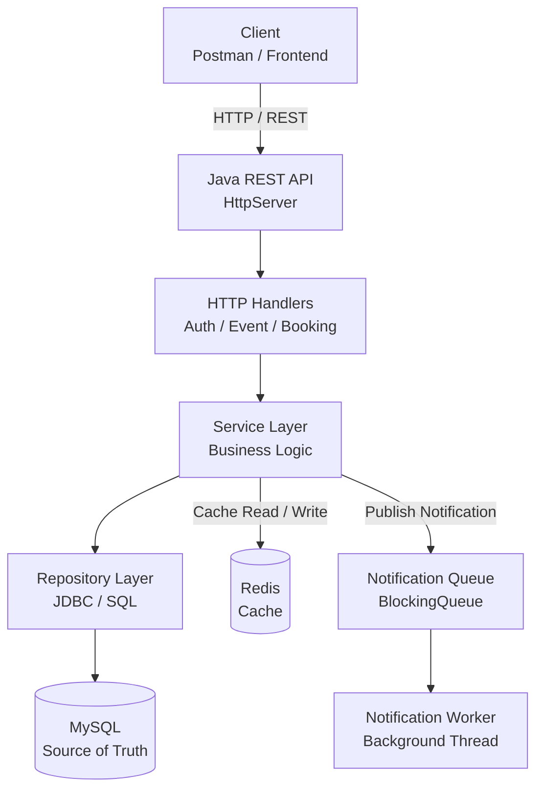
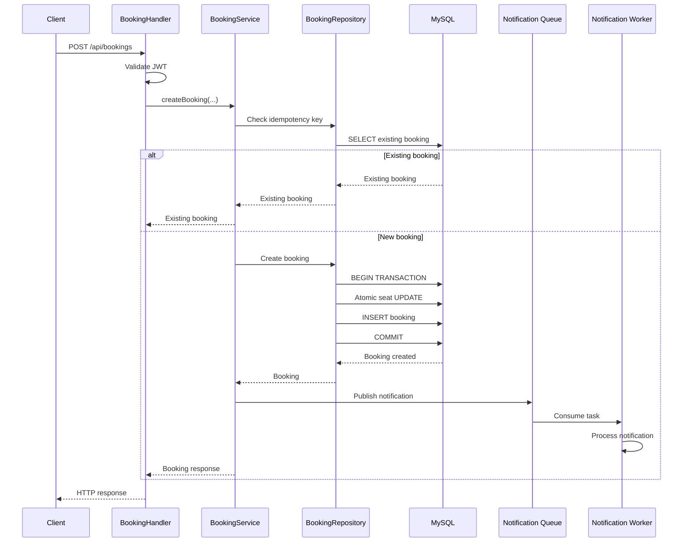
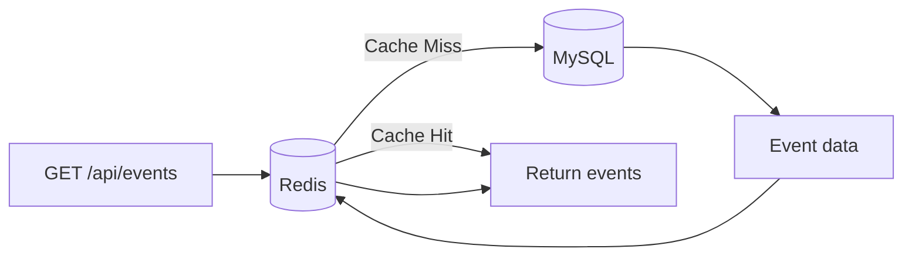
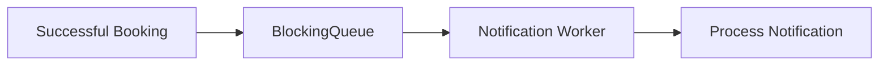
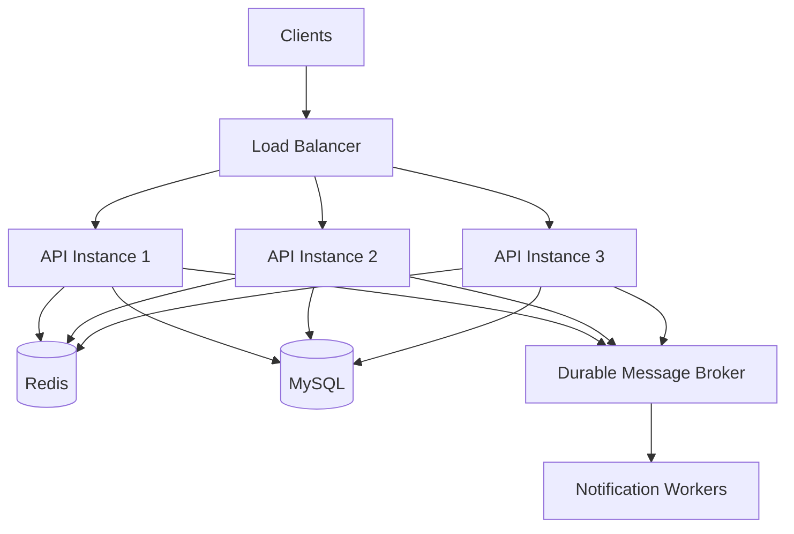

# System Architecture



## 1. Overview

The Real-Time Event Booking & Seat Management System follows a layered backend architecture.

The application is built using Java 21's built-in HTTP server and communicates with MySQL, Redis, and an asynchronous notification queue.



---

## 2. Application Layers

### HTTP Layer

The HTTP handlers are responsible for:

* Reading HTTP requests
* Parsing JSON
* Extracting JWT authentication information
* Calling the appropriate service
* Returning HTTP responses

Main handlers:

```text
AuthHandler
EventHandler
BookingHandler
```

---

### Service Layer

The service layer contains business logic.

```text
AuthService
EventService
BookingService
```

Examples:

* Validate registration/login
* Generate JWT
* Check idempotency
* Book seats
* Cancel bookings
* Publish notification tasks
* Read events through Redis cache

---

### Repository Layer

Repositories are responsible for database operations using JDBC.

```text
UserRepository
EventRepository
BookingRepository
```

The repository layer contains SQL queries and transaction handling.

---

## 3. Booking Request Flow



---

## 4. Redis Cache Strategy

The event listing endpoint uses a cache-aside strategy.



The current implementation caches the event list with a TTL.

MySQL remains the source of truth.

Redis is not used to decide whether a booking is valid.

---

## 5. Notification Architecture

Notifications are processed asynchronously.



This prevents notification processing from becoming part of the critical booking path.

The current worker simulates notification delivery.

A production implementation could replace the in-memory queue with Kafka, RabbitMQ, or Amazon SQS.

---

## 6. Scalability

The current implementation runs as a single API instance.

A production deployment could use multiple stateless API instances:



This is a production-oriented extension and is **not claimed as part of the current local implementation**.
