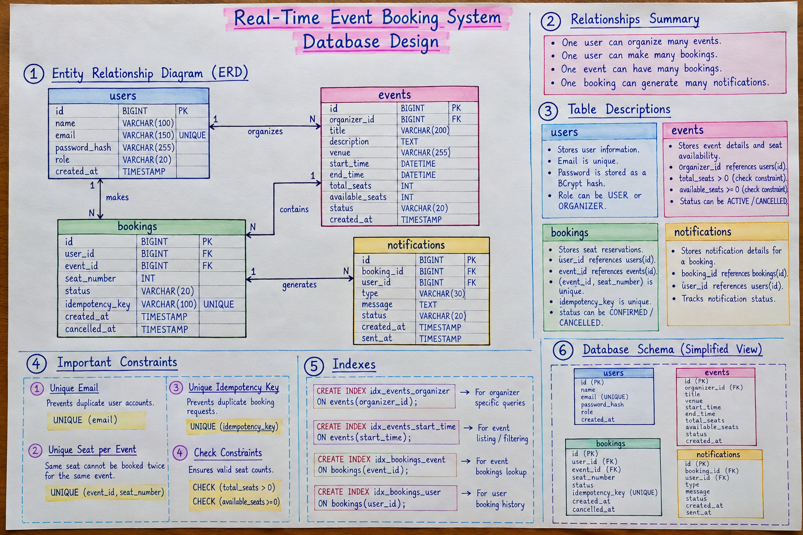
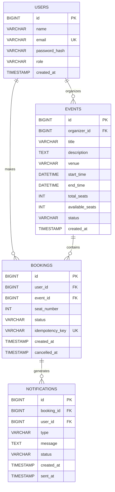

# Database Design



## 1. Overview

The system uses MySQL as the primary relational database.

MySQL was selected because the booking workflow requires:

* ACID transactions
* Foreign key constraints
* Unique constraints
* Consistent seat updates
* Reliable relational data

The database contains four primary tables:

```text
users
events
bookings
notifications
```

---

## 2. Entity Relationship Diagram



---

## 3. Users

The `users` table stores authentication and user information.

Important fields:

| Field           | Purpose                 |
| --------------- | ----------------------- |
| `id`            | Primary key             |
| `name`          | User name               |
| `email`         | Unique login identifier |
| `password_hash` | BCrypt password hash    |
| `role`          | USER / ORGANIZER        |
| `created_at`    | Account creation time   |

The email field is unique to prevent duplicate accounts.

---

## 4. Events

The `events` table stores event information and seat availability.

Important fields:

| Field             | Purpose                 |
| ----------------- | ----------------------- |
| `id`              | Event identifier        |
| `organizer_id`    | Event owner             |
| `title`           | Event name              |
| `venue`           | Event location          |
| `start_time`      | Start time              |
| `end_time`        | End time                |
| `total_seats`     | Maximum seats           |
| `available_seats` | Current available seats |
| `status`          | ACTIVE / CANCELLED      |

### Why store `available_seats`?

Without storing it, every availability request would need to calculate:

```sql
SELECT COUNT(*)
FROM bookings
WHERE event_id = ?
AND status = 'CONFIRMED';
```

Instead, the system maintains `available_seats` for fast reads and updates it transactionally during booking/cancellation.

---

## 5. Bookings

The `bookings` table represents seat reservations.

Important fields:

| Field             | Purpose                     |
| ----------------- | --------------------------- |
| `id`              | Booking identifier          |
| `user_id`         | User making the booking     |
| `event_id`        | Event being booked          |
| `seat_number`     | Selected seat               |
| `status`          | CONFIRMED / CANCELLED       |
| `idempotency_key` | Prevents duplicate requests |
| `cancelled_at`    | Cancellation timestamp      |

### Unique Seat Constraint

The following constraint is critical:

```sql
UNIQUE(event_id, seat_number)
```

It guarantees that the same seat cannot be assigned twice within the same event.

---

## 6. Notifications

The `notifications` table stores notification information associated with bookings.

The current implementation processes notifications through an in-memory queue and worker.

The table provides a structure for tracking notification state if persistent notification processing is added.

---

## 7. Indexes

The database contains indexes for frequently queried columns.

```sql
CREATE INDEX idx_events_organizer
ON events(organizer_id);

CREATE INDEX idx_events_start_time
ON events(start_time);

CREATE INDEX idx_bookings_event
ON bookings(event_id);

CREATE INDEX idx_bookings_user
ON bookings(user_id);
```

### Why indexes?

Indexes reduce the amount of data MySQL needs to scan for common queries.

For example:

```sql
SELECT *
FROM bookings
WHERE event_id = ?;
```

can use the `idx_bookings_event` index.

---

## 8. Transactional Booking

Booking involves two related operations:

```text
1. Decrease available seats
2. Insert booking
```

They are executed in one transaction:

```text
BEGIN
   │
   ├── Atomic seat update
   │
   ├── Insert booking
   │
   └── COMMIT
```

If any operation fails:

```text
ROLLBACK
```

This prevents partial updates.

---

## 9. Concurrency Protection

The booking operation uses:

```sql
UPDATE events
SET available_seats = available_seats - 1
WHERE id = ?
AND available_seats > 0;
```

The application checks the number of affected rows.

```text
1 row affected
    ↓
Seat successfully reserved

0 rows affected
    ↓
No seats available
    ↓
409 Conflict
```

This is safer than performing a separate availability check followed by an update.

---

## 10. Database as Source of Truth

The system deliberately separates caching from transactional data.

```text
                 ┌─────────────┐
                 │    Redis    │
                 │   Cache     │
                 └─────────────┘
                       │
                    Performance

                 ┌─────────────┐
                 │    MySQL    │
                 │ Source of   │
                 │    Truth    │
                 └─────────────┘
                       │
                 Booking State
                 Seat State
                 User Data
```

Redis failure should not change the correctness of the booking transaction.
