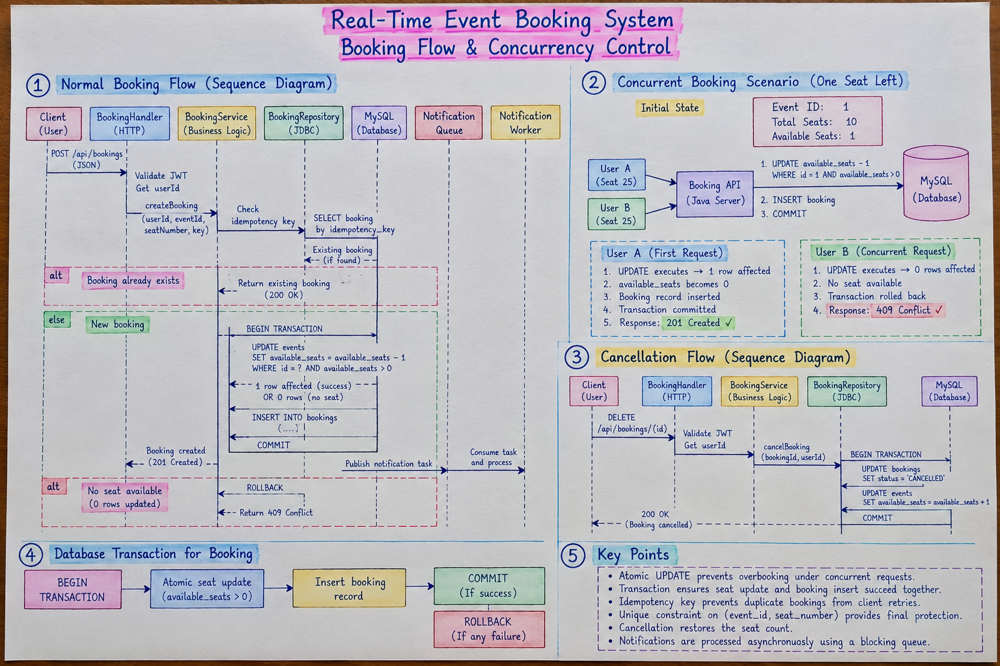
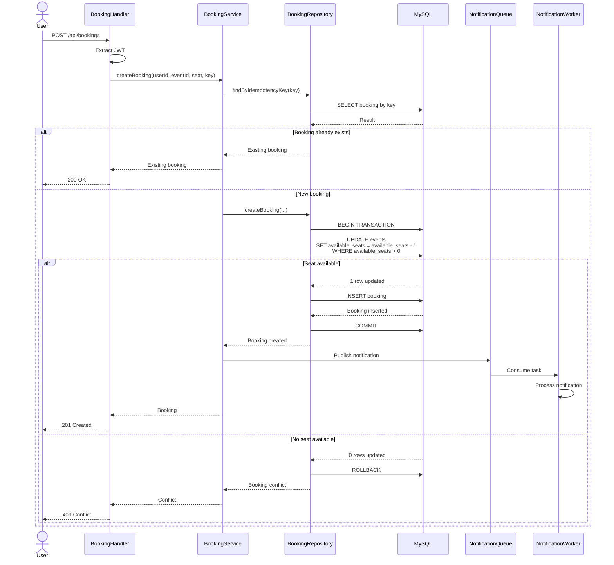
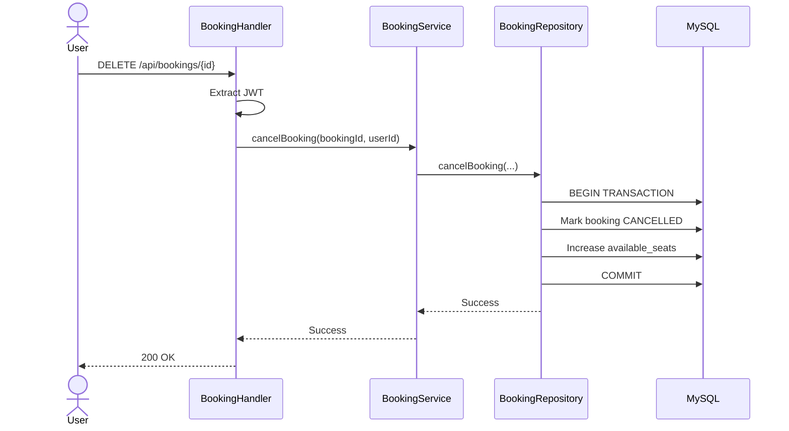

# Booking Flow & Concurrency Control



## 1. Normal Booking Flow

A user sends a booking request containing:

```json
{
  "eventId": 1,
  "seatNumber": 25,
  "idempotencyKey": "booking-123"
}
```

The user identity is obtained from the JWT rather than accepting a `userId` from the request body.

---

## 2. Complete Booking Sequence



---

# 3. Concurrent Booking Scenario

Consider an event with only one remaining seat.

```text
Available seats = 1
```

Two users send booking requests at approximately the same time.

```text
User A ───────────────┐
                     │
                     ▼
                Booking API
                     ▲
                     │
User B ──────────────┘
```

Both requests eventually reach the database.

The important operation is:

```sql
UPDATE events
SET available_seats = available_seats - 1
WHERE id = ?
AND available_seats > 0;
```

---

## 4. What Happens Internally?

Suppose User A's transaction reaches the database first.

```text
Initial:
available_seats = 1

User A:
UPDATE ... WHERE available_seats > 0

Result:
1 row affected

available_seats = 0
```

User A can then insert the booking and commit.

When User B's transaction attempts the same operation:

```text
Current:
available_seats = 0

User B:
UPDATE ... WHERE available_seats > 0

Result:
0 rows affected
```

The application interprets this as a booking conflict.

```text
User A → 201 Created
User B → 409 Conflict
```

Therefore:

```text
Only one booking
        +
No negative seat count
        +
No overbooking
```

---

# 5. Why Not Use `synchronized`?

A Java `synchronized` block could protect access inside one JVM:

```java
synchronized (lock) {
    // booking logic
}
```

However, this does not provide sufficient protection when the application runs on multiple servers.

For example:

```text
             Load Balancer
                 │
          ┌──────┴──────┐
          ▼             ▼
       Server A       Server B
          │             │
      JVM Lock A     JVM Lock B
```

The locks belong to different JVMs.

The database, however, is shared:

```text
Server A ───────┐
                ▼
             MySQL
                ▲
Server B ───────┘
```

Therefore, the database-level atomic operation provides concurrency protection across application instances.

---

# 6. Why a Transaction Is Still Required

The atomic update solves the seat race condition, but booking still consists of multiple operations.

```text
1. Decrease available seats
2. Insert booking
```

Without a transaction:

```text
Seat decreased
      ↓
Application crashes
      ↓
Booking never inserted
```

The event would incorrectly lose a seat.

With a transaction:

```text
BEGIN
  ↓
Seat update
  ↓
Booking insert
  ↓
COMMIT
```

If the booking insertion fails:

```text
ROLLBACK
```

The seat update is also undone.

---

# 7. Idempotency and Concurrency Solve Different Problems

These two concepts are easy to confuse.

### Concurrency control

Protects against:

```text
Multiple users
      ↓
Same seat
      ↓
At the same time
```

### Idempotency

Protects against:

```text
Same client
      ↓
Same request
      ↓
Retry due to timeout/network issue
```

Example:

```text
Request:
idempotencyKey = "booking-123"

First request:
Booking created

Retry:
Existing booking returned
```

Therefore the system uses both:

```text
Concurrency control
        +
Transaction
        +
Unique constraint
        +
Idempotency
```

to make booking safer.

---

# 8. Cancellation Flow

Cancellation is implemented as a state transition rather than deleting the booking.



The booking record remains in the database with:

```text
status = CANCELLED
```

This preserves booking history.

---

# 9. Key Interview Explanation

If asked:

> "How did you prevent overbooking?"

A concise answer is:

> "I avoided doing a separate availability check followed by an update because that creates a race condition. Instead, I use an atomic conditional UPDATE that decrements the seat only when `available_seats > 0`. If the update affects zero rows, the seat is unavailable and I return 409 Conflict. The seat update and booking insertion are inside the same MySQL transaction, and I also have a unique constraint on `(event_id, seat_number)` as a final database-level safeguard."

That is the core concurrency design of this project.
